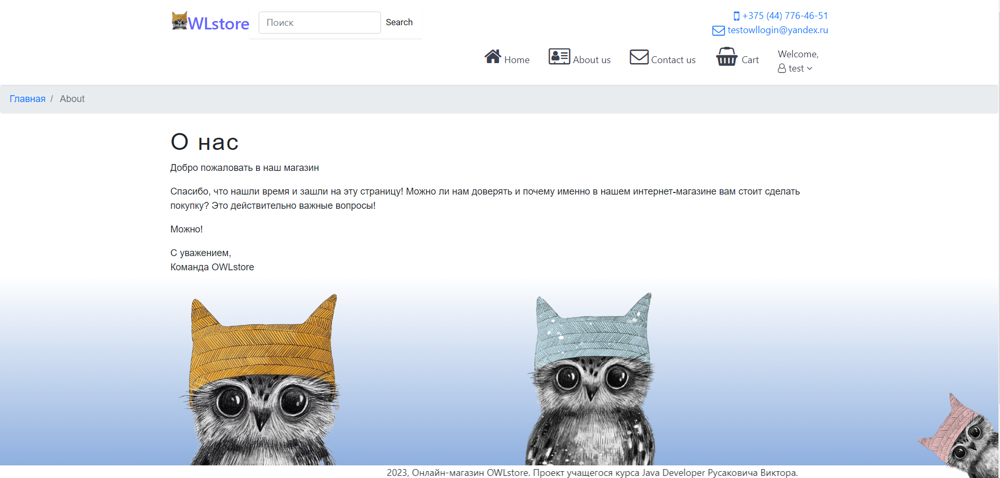
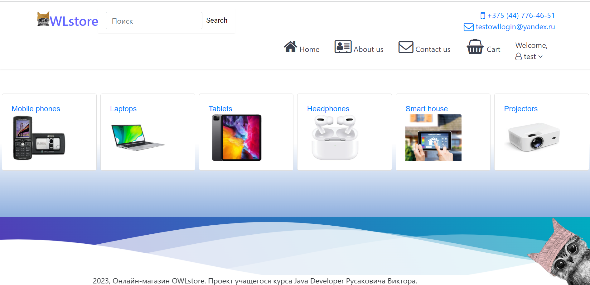
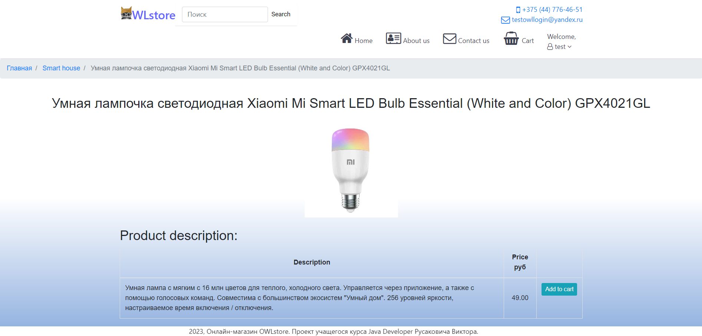
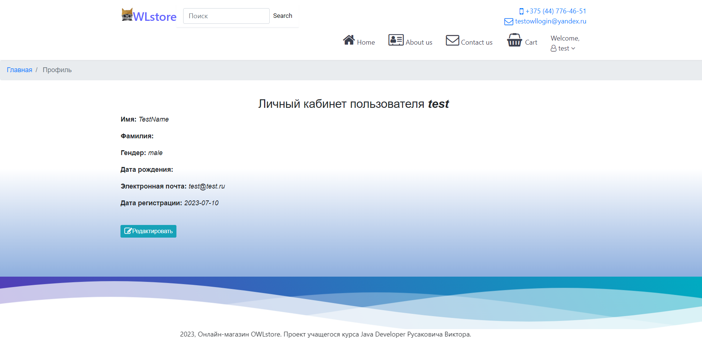
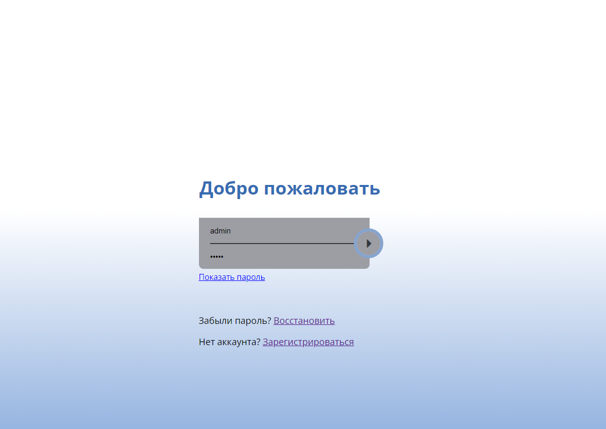
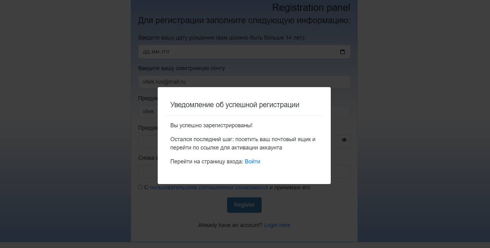
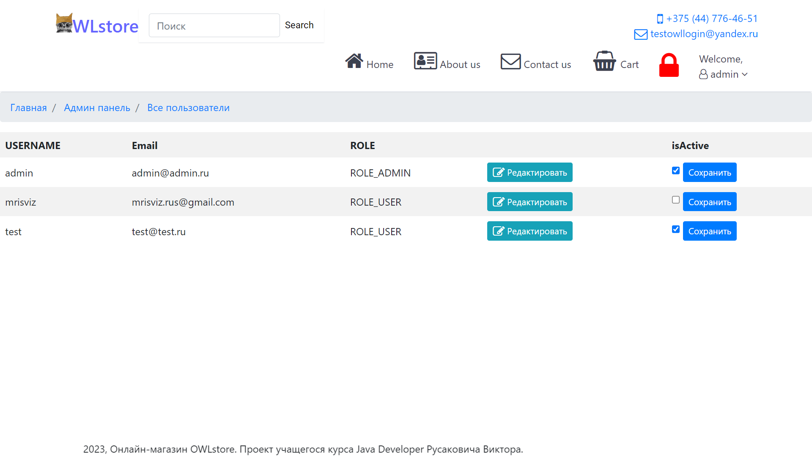
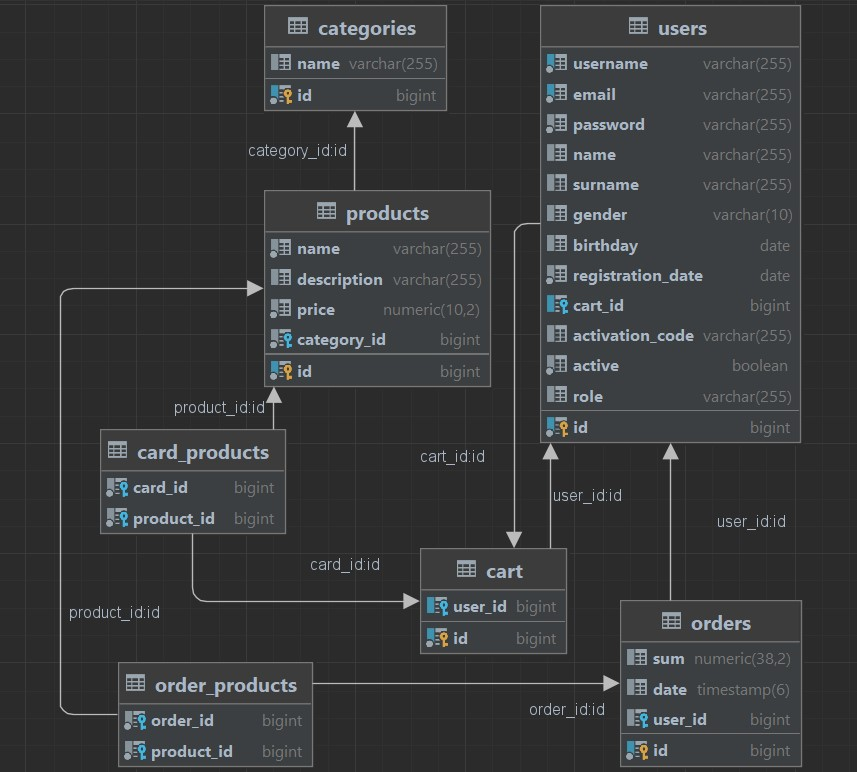

# :satellite: О проекте OWLstore 

Java приложение OWLstore представляет собой простую версию онлайн-магазина с необходимым функционалом. 
Приложение предусматривает взаимодействие пользователя с онлайн-каталогом (выборка, поиск, сортировка, добавление в корзину, оформление заказа), взаимодействие со вспомогательными пользовательскими интерфейсом (регистрация, авторизация, аутентификация, редактирование данных профиля), взаимодействие с интерфейсом администратора (выдача ролей, восстановление и изменение паролей, активация аккаунта, обратная связь). 

Приложение написано на Java 17, задействован функционал Spring фреймворка (Boot, MVC, Security). Веб-часть написана с использованием Thymeleaf. 
Более подробно стек технологий представлен ниже.

## :camera: Скриншоты: 
<details>
  <summary><strong>Больше скриншотов</strong></summary>
  
    *Домашняя страница*
  

    *Страница продукта*
  

    *Страница профиля*
  

    *Страница входа*
  

    *Страница регистрации*
  

    *Страница администратора*

  
  
    *Страница "О нас"*
  

</details>

 ## :toolbox: Стек технологий:
 
<details>
 <summary><strong>Показать список</strong></summary>

**Java 17 LTS**

**Фреймворки и библиотеки:**
Spring Boot 3.1.0,
Spring MVC;

**Работа с данными:**
Spring Data JPA,
Hibernate,
Flyway Core;

**Веб-технологии:**
Thymeleaf,
Thymeleaf Extras Spring Security 6,
Spring Boot Starter Mail;

**Валидация и безопасность:**
Spring Security,
Spring Validation;

**Инструменты разработки:**
Lombok,
MapStruct;

**Тестирование:**
JUnit 5;

**Дополнительные инструменты:**
Spring Boot DevTools;

**Логирование:**
Log4j2;

**Базы данных:**
PostgreSQL;

**Плагины сборки:**
Maven Compiler Plugin,
Maven PMD Plugin,
SpotBugs Maven Plugin,
Maven Checkstyle Plugin,
Flyway Maven Plugin;

**Визуал:**
HTML, CSS, Bootstrap;
</details>

## :gear: Как запустить проект локально:

Для корректной работы у вас должен быть установлен JDK с 17+ версией JAVA.

<details>
 <summary><strong>Показать</strong></summary>
1. Склонировать репозиторий себе на компьютер
   
```bash
  git clone https://github.com/rusakovich-viktar/SpringOwlStore.git
```

2. В файле application.property добавить значения email и password почтового ящика, который будет исполнять функции саппорта для поддержки функций, связанных с активацией аккаунта, обратной связи, сбросом пароля)
   
```bash
   spring.mail.username=
   spring.mail.password=
   ```

   </details>
   
## :memo: Структура базы данных:

<details>
 <summary><strong>Показать</strong></summary>
   


</details>

## :telephone: Контакты:

Viktar Rusakovich - Java developer 

  v1rusakovich@gmail.com<br>
  [linkedin.com/in/rusakovich/](https://www.linkedin.com/in/rusakovich/)<br>
  [t.me/@Vitek11](https://t.me/Vitek11)<br>
  +375447764651
